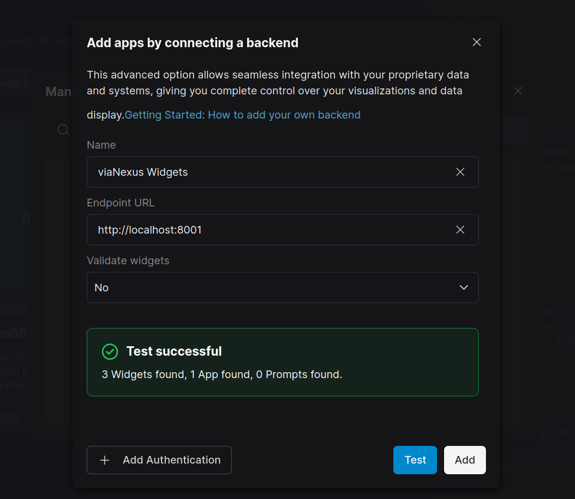
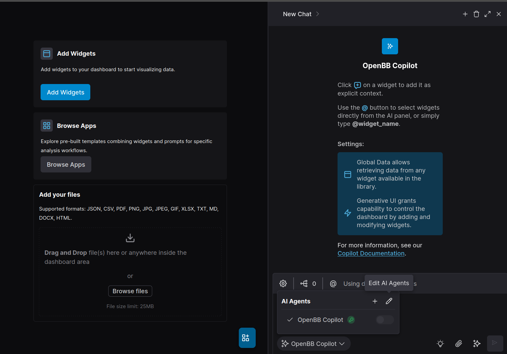
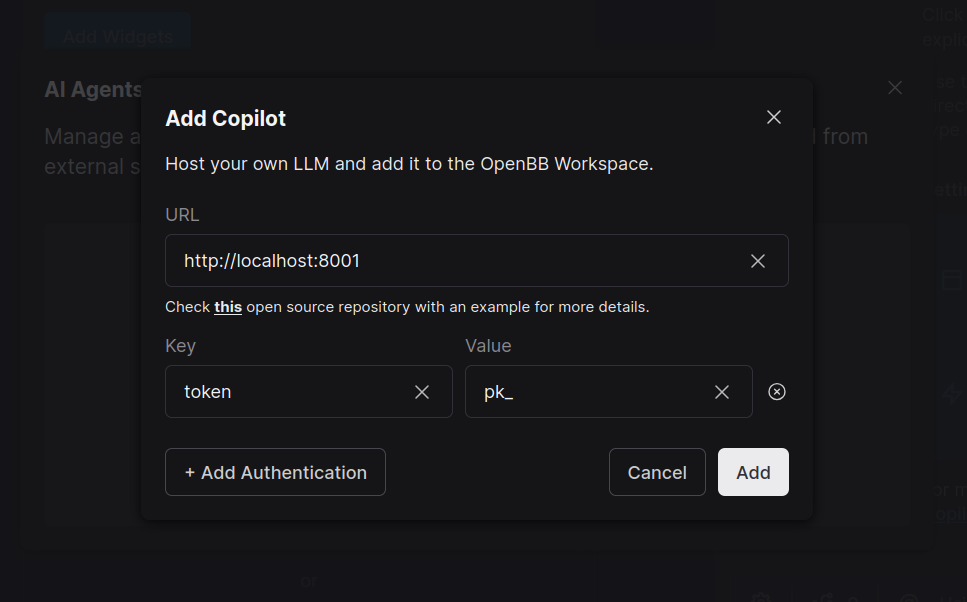

# nexus-agent

OpenBB-compatible interface layer that bridges OpenBB Workspace to the viaNexus financial agent ecosystem.

## Architecture

```
OpenBB → nexus-agent → financial-chat-agent → viaNexus SDK → MCP server
              │               │                    │              │
        SSE adapter    client_context      X-Tool-Categories   tags filter
                       {type:"openbb"}     header routing      (tool filtering)
```

nexus-agent transforms OpenBB's SSE-based protocol to communicate with the financial-chat-agent backend, enabling AI-powered financial analysis within the OpenBB Workspace.

## Installation

```bash
# Install dependencies
uv sync

# Install dev dependencies (linting, testing)
uv sync --extra dev

# Copy the `.env.example` file to .env and fill in the values
cp .env.example .env
```

## Running the Server

```bash
# Start the development server (port 8001)
uv run python main.py

# Or using the script entry point
uv run nexus-agent
```

The server exposes the following endpoints:
- `GET /agents.json` - Agent metadata for OpenBB discovery
- `POST /query` - SSE streaming endpoint for chat queries
- `GET /widgets.json` - Available widget configurations
- `GET /apps.json` - Pre-configured dashboard layouts
- `GET /health` - Health check endpoint

## Configuration

Environment variables (set in `.env` file):

| Variable | Description | Default |
|----------|-------------|---------|
| `FINANCIAL_AGENT_URL` | URL of financial-chat-agent backend | `http://localhost:8501` |
| `AGENT_NAME` | Display name for OpenBB | `viaNexus Financial Agent` |
| `AGENT_DESCRIPTION` | Agent description for OpenBB discovery | (see config.py) |
| `WIDGET_ORIGIN` | Origin identifier for widgets | `viaNexus Widgets` |

## Setup Walkthrough

### 1. Add Backend Widgets
1. On the left sidebar click on `Apps`
2. Click on `Connect Backend`
3. Fill out the form, use "viaNexus Widgets" in the `Name` field
4. Click `Test`
5. Click `Add`


### 2. Configure Agent
1. Navigate to your dashboard
2. Open the right sidebar/chat UI
3. Click on OpenBB Copilot and the pencil icon `Edit AI Agents`

4. Click on `Add your first AI agent`
5. Fill out the form, be sure to include your viaNexus api token in the `token` field under `Authentication`


## Project Structure

```
nexus-agent/
├── main.py                 # FastAPI app entry point
├── registry.py             # Widget registration system
├── pyproject.toml          # Project configuration
├── src/
│   ├── config.py           # Environment configuration
│   ├── agent/              # Core agent functionality
│   │   ├── stream_response.py   # SSE streaming logic
│   │   ├── widget_context.py    # Widget metadata formatting
│   │   └── widget_discovery.py  # Widget catalog
│   ├── utils/              # Utility modules
│   │   ├── sse.py          # SSE message formatting
│   │   ├── logging.py      # Logging configuration
│   │   └── plotly_config.py    # Chart defaults
│   ├── vianexus/           # viaNexus SDK integration
│   │   ├── schemas.py      # API response schemas
│   │   └── dataset.py      # Dataset handling
│   ├── widgets/            # Widget implementations
│   │   ├── stock_stats.py  # Stock statistics widget
│   │   ├── stock_chart.py  # Stock chart widget
│   │   └── rules.py        # Rules table widget
│   └── documents/          # Static configuration
│       └── apps.json       # Dashboard layouts
└── tests/                  # Test suite
    └── test_stream_response.py
```

## Development

### Linting

```bash
# Check for issues
uv run ruff check .

# Auto-fix issues
uv run ruff check --fix .

# Format code
uv run ruff format .
```

### Testing

```bash
uv run pytest
```

## OpenBB Integration

This service implements the OpenBB agent protocol:

1. **Agent Discovery**: `/agents.json` returns metadata for OpenBB to discover and configure the agent
2. **Query Handling**: `/query` accepts `QueryRequest` messages and returns SSE events
3. **Widget Support**: Provides backend widgets that can be added to OpenBB dashboards

### SSE Events

The service streams various event types:
- `message_chunk` - Text response chunks
- `chart` - Visualization data
- `table` - Tabular data
- `update_widget_in_dashboard` - Widget parameter updates
- `add_widget_to_dashboard` - Add new widgets
- `citations` - Data source citations

## Related Services

This service is part of a multi-repository architecture:
- **financial-chat-agent** - LLM agent with MCP client capabilities
- **viaNexus-agent-sdk-python** - SDK for MCP server connections
- **mcp-service** - MCP server with financial data tools

## Contributing

1. Create a feature branch from `main`
2. Make your changes
3. Run linting: `uv run ruff check .`
4. Run tests: `uv run pytest`
5. Submit a pull request
